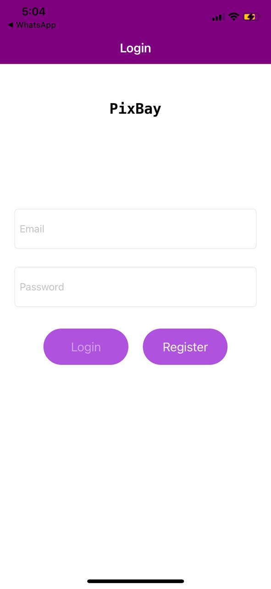
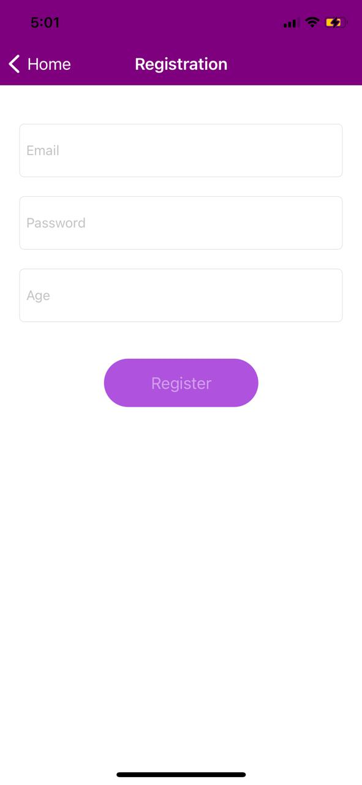
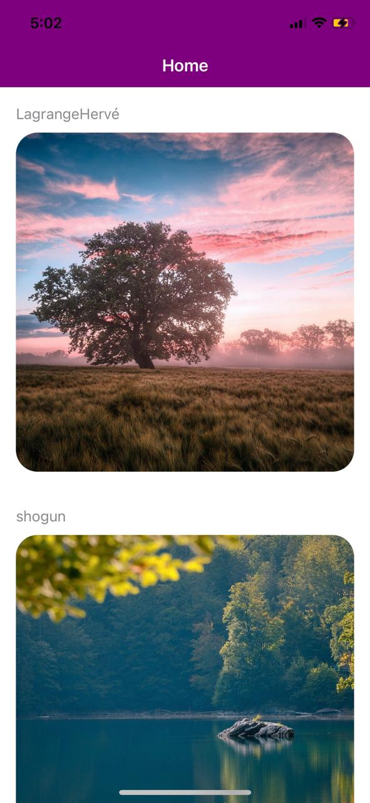
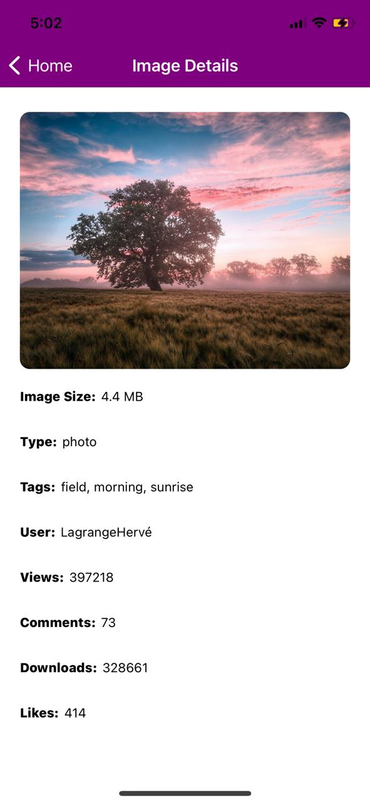
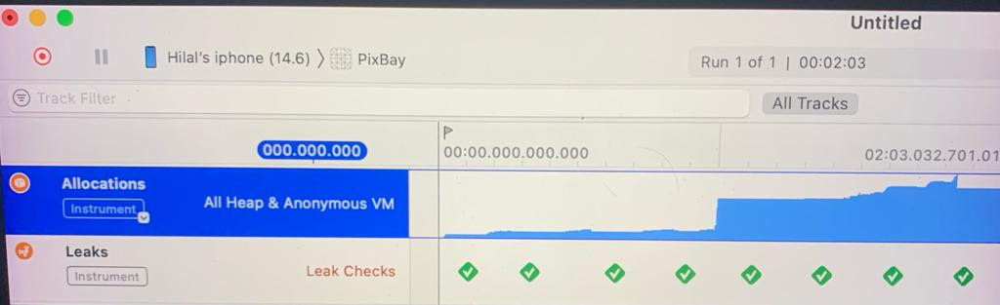

# PixaBay

## Screenshots

&emsp;  &emsp;   &emsp;  

## PixaBay 
The architecture used to build PixaBay app is MVVM, with helping hands from RxSwift. 
The navigation is handled by a coordinator. It is responsable to remove navigation logic from each view and have them all in just one place. 

i created a Framework for the Network ,to seperate the network api requests  from the main app  so i could be able to use it for other targets
the APIResponse is internal and inherits Decodable and mapped into a DomainObject, so any change to the BackendResponse requires only a change in the ToDomain function instead of changing the object in the whole app

the DI Container resolves the HTTPClient to the URLSessionHTTPClient and the repositories to their corresponding objects . the host URL is injected so i could be able to change it when the environment changes (DEV-UAT-PROD).

I used a WeakRef Object instead of using weak instances for the coordinator,which helped me test the behavior (for example using a SpyCoordinator) and as well as extracting the memory management away from the viewController 

## Third-party Libraries
 
Resolver https://github.com/hmlongco/Resolver
Dependency injection framework for Swift.

SVProgressHUD (https://github.com/SVProgressHUD/SVProgressHUD)
Loader Animation 

AJMessage (https://github.com/ajijoyo/AJMessage)
View To display Error Messages

# Views Overview
All views are done in storyboards, 

  
Login

The Login View has 2 fields (Email and Password) which both inherit `ErrorTextField`,`TextFieldRule` where each once has it owns `Validationpolicy` and when it's valid the `errorLabel` appears and when it's not it becomes Hidden 
when Both TextField Are Valid the `LoginButton` is enabled 

The `LoginViewModel` handles the state of each textfield , and has an injected `UserRepository` that contains all the requests for the Registration, 
the `LoginResponseSubject` acts as a trigger to notify the view that a response has been received . 
The Correct credentials are **test@mail.com** and **123456**
 
The ScrollView bottom insets is Binded to the `KeyboardHeight`
The LoadingAnimation is Binded to the `loaderSubject` that exists in the viewModel 
The `LoginCoordinator` handles the transition to the RegistrationView and asWell as transition to the HomeView

  
Registration

  

The Registration has 3 fields (Email,Password,Age) where each has its own validation policy same as the LoginView, 
it's similar to the login screen in terms of validation , Loading behavior and architecture
 

  
Home

The HomeView contains Images downloaded From pixabay. 
I didn't use `SDWebImage` to download the images , instead i created a `HitImageCellController` that contains a reference to the cell and Handles the image download ,  
Instead of waiting to scroll to load the images i `preload` them in advance, and if the cell has ended Displaying i cancel the download or `cancelPrefetchingForRowsAt` has been called
Keeping large images in memory will result in a heavy usage of Ram , so i saved them in the `Documents` folder and load them according to the id .

  
Network

I created a `UserRepositroy` and `Pixabay Repository` which contain an injected `HTTPClient` that uses `URLSession` where they contains the Login and Registration  Calls and downloadImage API requests .
The mapping is done in the `ResponseMapper` where it has an injected `DecodedType` which is the Decodable object , `URLResponse` and `Data` 
if the status code isn't `200`, the api error is returned with a custom message according to the response status code. 

  
Unit Tests

 All Tests covered handle retain cycles, i set a weak variable value to an instance and observe its value when the test is completed the instance should be nil thus the weak variable as well , if not then we would have a retain cycle . any by using **Leaks** i made sure there are no leaks as well 
(`trackForMemoryLeaks in XCTestCase+MemoryLeakTracking`)

&emsp;

 

## PixaBaySnapshotsTests: 
 
I use the func `record` to take a screenshot of the view for `LightMode` and `DarkMode` and save it in the same directory of the test, then i use `assert` func to make sure that the new screenshot is the same as the old value .Usually i use this test to quickly check the change for each Language and Appearance 
for each view.

## The PixaBayTests: 

#### TextFields: 

 Handled all states to check if it's valid or not as well as checking the error Label 

#### ViewModels: 

 Handled all states to check if the loginButton or Registration Button will get enabled  

#### ImageDetails: 

Assert That the injected ViewModelValues are the same as the ImageDetails Label Text

#### HomeView:  **Incomplete**

     1)`RefreshControl` is Visible and Refreshing on start
     2)on Refresh the viewModel calls the Repository to getData (Using a repositorySpy to observe that the call has been made)
     3)Received item is properly rendered on Screen (Get the cell from tableView and compare the values of model and tableViewCell)
     4)Test Preload and `cancelPreload` and `DidEndEditing` if it will cancel the APiRequest(check the SubscribeBlock on disposed if it gets called)
     5)OnError the `retryButton` is visible (Emitting an Error from the `PixaBayRepositoryMock` and  checking the cell if its `retryButton` is visible)
     6) OnErrorPress the image gets downloaded ( Using a `repositorySpy` to check if the Api function is called)
     7) Check if the image is Animating at start (Check if the View `layer.mask.animation(forKey: shimmerAnimationKey) != nil`)
     8) Check if an image that exists in the `DocumentsDirectory` will be used instead of downloading it from the internet
     9)Check if an image that doesn't exist in the `DocumentsDirectory` will be downloaded and saved in the Documents

#### Scene Delegate: 

Check if the window is visible and the `loginViewController` is the rootViewController

#### Coordinators: 

 Tested the start function and the navigation for each Coordinator 

## PixaBayNetworkTests

-Tested the `ResponseMapper` for each status code , and for a valid and invalid Data 

-Stubbed the `URLSession` where i used the `URLProtocol` to set a custom Response using the `URLProtocolStub` 

 
